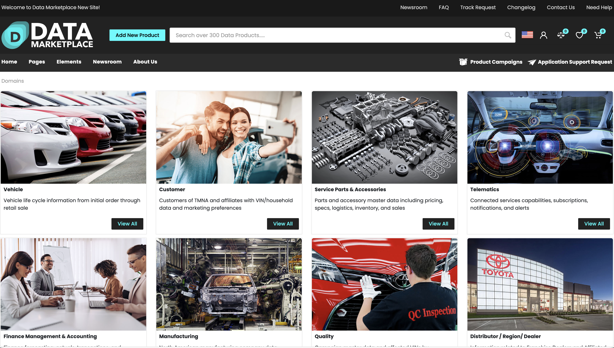

  <h1 align="center"> 
    <a href="README.md">
         Global Enterprise Data Marketplace
    </a>
  </h1>

 

    <a href="GETTING-STARTED.md">Getting Started</a> · 
    <a href="BUILD-COMMANDS.md">Build Commands</a> · 
    <a href="FEATURES.md">Features</a> · 
    <a href="TECH-STACK.md">Tech Stack</a> · 
    <a href="INTEGRATION.md">Integration</a> ·
    <a href="https://github.com/Toyota-Motor-North-America/edmp-seed-repo/issues">Submit an Issue</a> ·
    <a href="CHANGELOG.md">Changelog</a> ·
     
  

  
Built With  
    
    
    
    
    
  

  

    
  

  

  	Global Enterprise Data Marketplace is a self-service data marketplace portal which enables TMNA users, business partners, affiliates, and contingent workers to discover and request Readily Available Data, Analytics, and Reports at Toyota. The Data Marketplace provides all Toyota users with the ability to search, discover and request any data, available in any form, at Toyota. This reduces the reliance on Data Stewards, Data Analysts, and other individuals/groups related to data management, and also saves the users a lot of time trying to find or request access to data.
  

  <h3 align="center">
  	<a href="https://www.data.toyota.c[README.md](../../../%40Toyota/dev/%40marketplace17/README.md)om"><strong>www.data.toyota.com</strong></a>
  </h3>

  

    
    
     
    <small>©2023 Toyota Motor North America | All Rights Reserved.</small> 
  

